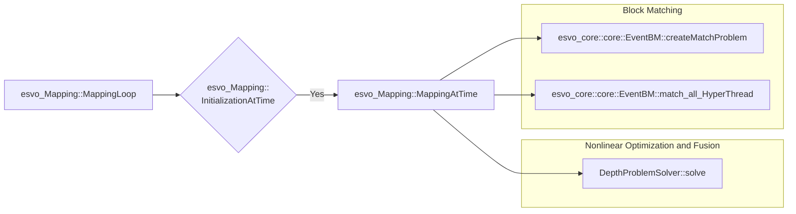
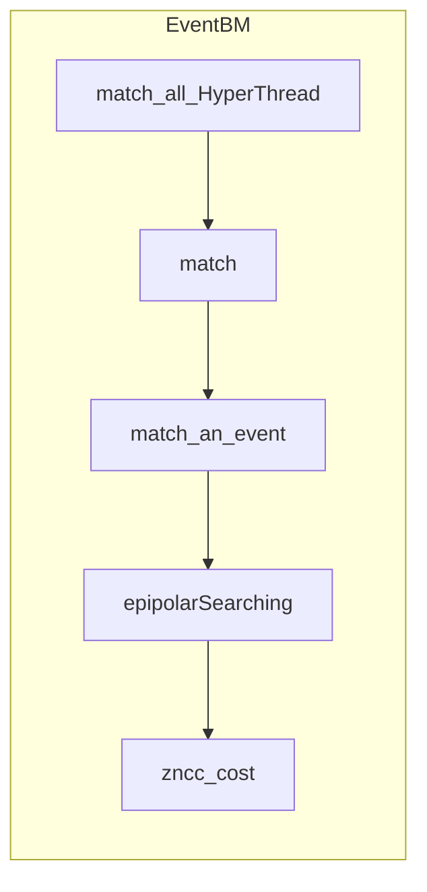
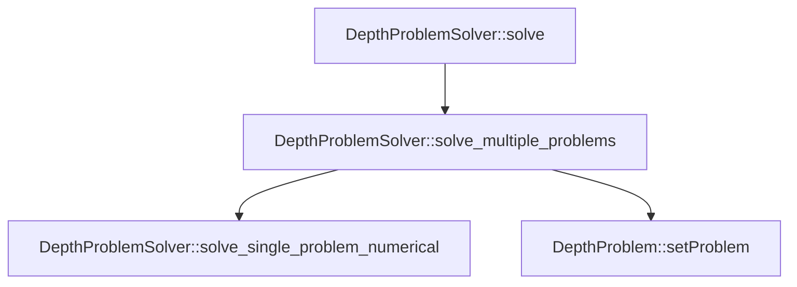

[Event-based Stereo Visual Odometry](https://doi.org/10.1109/TRO.2021.3062252) 提出了一种基于双目事件相机的视觉里程计。
在 [Github上开源了代码](https://github.com/HKUST-Aerial-Robotics/ESVO.git)，项目主要由 Cpp 实现，运行环境为 ROS, 本文的重点并不是如何运行代码，所以忽略了 ROS 中节点以及 launch file.  ~~挖个坑以后填上~~，本文旨在对其中的功能实现的部分关键代码进行解读。

本文之后的部分将 Event-based Stereo Visual Odometry 简写为ESVO.
为了提高计算效率，达到实时性的要求，ESVO 采用了多线程的方法，将计算任务分配给多个线程，同时进行计算。Cpp 多线程的操作有待深入学习。~~现在看不懂~~

> TODO: Cpp Multithreading
> {: .prompt-info }

## System Flowchart

ESVO 的 flowchat 如下图所示，主要由三大部分组成，分别是 Event Preprocessing, Mapping, Tracking.

Event Preprocessing
: 对输入的原始事件流进行滤波，生成 Time-Surface Maps.

Mapping
: 接收Time-Surface, 进行双目匹配，得到深度，生成 Local Map 与 Point Cloud.

Tracking
: 对 Local Map 进行跟踪，生成相机的 Pose(6Dof), 将变换矩阵返回给 Mapping 模块


_ESVO System Flowchart[^1]_

## Code Understanding

> 本文图片若无特殊说明均来自于 `Scientific Toolworks Understand v6.4`
> {: .prompt-info }

ESVO 代码组成如下图所示，主要由三个模块组成，分别是 `esvo_time_surface`, `esvo_Mapping`, `esvo_Tracking`.

TimeSurface
: `esvo_time_surface` 中的 `TimeSurface` 实现了 Event Preprocessing 部分，对输入的原始事件流进行滤波，生成 Time-Surface Maps.

esvo_Mapping
: `esvo_core` 中的 `esvo_Mapping` 实现了 Mapping 部分，接收Time-Surface，得到深度，生成 Local Map 与 Point Cloud.

esvo_Tracking
: `esvo_core` 中的 `esvo_Tracking` 实现了 Tracking 部分，对 Local Map 进行跟踪，生成相机的 Pose(6Dof), 将变换矩阵返回给 Mapping 模块

esvo_MVStereo
: `esvo_core` 中的 `esvo_MVStereo` 实现了 ESVO mapper 部分，以及其他的一些 event-based mapping methods[^2][^3]. 作为 multi-view stereo (MVS) pipeline, 该模块需要先验的 pose 作为输入


## Time-Surface

Time-Surface 是一种将事件流转换为类似于图像帧的数据结构的方法，使得事件流的信息可以用传统的计算机视觉算法处理。Time-Surface 的核心思想是将事件流的时间信息转换为空间信息，将事件流的时间戳 $t_i$ 转换为像素的灰度，这样就可以将事件流转换为图像帧。
本博客在之前已经对 Time-Surface 做了详细的说明，你可以点击这里查看：[事件相机图像重构：浅谈Time-Surface](https://2c984r83y.github.io/posts/timesurface/ "事件相机图像重构：浅谈Time-Surface")

ESVO 中的 Time-Surface 实现在 `esvo_time_surface` 中，`TimeSurface_node.cpp`在 ROS 中作为节点运行，`TimeSurface.cpp` 实现了 Time-Surface 的核心算法以及滤波和矫正等功能。
由于水平有限所以在这里只分析 `void TimeSurface::createTimeSurfaceAtTime(const ros::Time& external_sync_time)`的实现，`void TimeSurface::createTimeSurfaceAtTime_hyperthread(const ros::Time& external_sync_time)`有待后续解读。
esvo_time_surface 文件架构如下图所示，`TimeSurface_node.cpp` 在 ROS 中启动节点，`TimeSurface.cpp` 实现了主要算法：


_esvo_time_surface architecture_

### Init something

在 `TimeSurface::createTimeSurfaceAtTime()`中：

```cpp
  // create exponential-decayed Time Surface map.
  const double decay_sec = decay_ms_ / 1000.0;
  cv::Mat time_surface_map;
  time_surface_map = cv::Mat::zeros(sensor_size_, CV_64F);
```

### getMostRecentEventBeforeT

函数 `getMostRecentEventBeforeT`的功能是找到(x,y)处距离现在的时间 t 最近的事件，是较为关键的函数：

```cpp
  // 找到距离时间 t 最近的事件
  bool getMostRecentEventBeforeT(
    const size_t x,
    const size_t y,
    const ros::Time& t,
    dvs_msgs::Event* ev)
  {
    if(!insideImage(x, y))
      return false;
    // using EventQueue = std::deque<dvs_msgs::Event>;
    // 双向开口的deque，可以从头尾两端进行插入和删除操作
    EventQueue& eq = getEventQueue(x, y); // 访问向量中第 x + width_ * y 个元素
    if(eq.empty())
      return false; // 如果该像素点没有事件，返回false

    // 从后往前遍历deque，找到第一个时间戳小于t的事件
    // 即找到距离时间 t 最近的事件
    for(auto it = eq.rbegin(); it != eq.rend(); ++it)
    {
      const dvs_msgs::Event& e = *it;
      if(e.ts < t)
      {
        *ev = *it;
        return true;
      }
    }
    return false;
  }
```

### Create Time-Surface

遍历所有坐标，若 `getMostRecentEventBeforeT`返回值为真，则将 `most_recent_event_at_coordXY_before_T`的时间戳转换为灰度值，赋值给 `time_surface_map`:

```cpp
  // Loop through all coordinates
  for(int y=0; y<sensor_size_.height; ++y)
  {
    for(int x=0; x<sensor_size_.width; ++x)
    {
      dvs_msgs::Event most_recent_event_at_coordXY_before_T;
      if(pEventQueueMat_->getMostRecentEventBeforeT(x, y, external_sync_time, &most_recent_event_at_coordXY_before_T))
      {
        // Time-Surface Implementation           
      }  
    }// loop x
  }// loop y
```

Time-Surface 有两种实现方式，Backward version 和 Forward version.

#### Backward version

Backward version 在事件坐标系下生成的，它直接在事件坐标系下生成 Time-Surface, 不需要相机的内参和外参信息。
从当前时间 t 开始，向前计算，时间戳越近，灰度值越大，即越亮。
公式定义如下所示：

$$
\mathcal{T}(\mathbf{x},t)\doteq\exp\left(-\frac{t-t_{\mathsf{last}}(\mathbf{x})}\eta\right)
$$

其中：
$t_last$ 是$(x,y)$处最近（最新）的事件的时间戳，即 `most_recent_event_at_coordXY_before_T.ts`
$t$ 是当前系统的时间戳，即 `external_sync_time`

```cpp
          const double dt = (external_sync_time - most_recent_stamp_at_coordXY).toSec();
          double polarity = (most_recent_event_at_coordXY_before_T.polarity) ? 1.0 : -1.0;
          double expVal = std::exp(-dt / decay_sec);
          if(!ignore_polarity_)
            expVal *= polarity;

          // Backward version
          if(time_surface_mode_ == BACKWARD)
            time_surface_map.at<double>(y,x) = expVal;
```

#### Forward version

Forward version 在相机坐标系下生成的，将事件投影到相机的图像平面上，然后在图像平面上生成时间表面。这个版本需要相机的内参和外参信息。
为了加快计算，使用了 look-up table 的方法，将事件投影到相机的图像平面上，然后在图像平面上生成时间表面。

```cpp
  // load look-up table
  for (size_t i = 0; i < sensor_size.height * sensor_size.width; i++)
  {
    precomputed_rectified_points_.col(i) = Eigen::Matrix<double, 2, 1>(
      RectCoordinates(i).x, RectCoordinates(i).y);
  }
```

```cpp
          // Forward version
          if(time_surface_mode_ == FORWARD && bCamInfoAvailable_)
          {
            Eigen::Matrix<double, 2, 1> uv_rect = precomputed_rectified_points_.block<2, 1>(0, y * sensor_size_.width + x);
            size_t u_i, v_i;
            if(uv_rect(0) >= 0 && uv_rect(1) >= 0)
            {
              u_i = std::floor(uv_rect(0)); // x coordinate, 下取整
              v_i = std::floor(uv_rect(1)); // y coordinate, 下取整

              if(u_i + 1 < sensor_size_.width && v_i + 1 < sensor_size_.height) //  防越界
              {
                double fu = uv_rect(0) - u_i;
                double fv = uv_rect(1) - v_i;
                double fu1 = 1.0 - fu;
                double fv1 = 1.0 - fv;
                time_surface_map.at<double>(v_i, u_i) += fu1 * fv1 * expVal;
                time_surface_map.at<double>(v_i, u_i + 1) += fu * fv1 * expVal;
                time_surface_map.at<double>(v_i + 1, u_i) += fu1 * fv * expVal;
                time_surface_map.at<double>(v_i + 1, u_i + 1) += fu * fv * expVal;

                if(time_surface_map.at<double>(v_i, u_i) > 1)
                  time_surface_map.at<double>(v_i, u_i) = 1;
                if(time_surface_map.at<double>(v_i, u_i + 1) > 1)
                  time_surface_map.at<double>(v_i, u_i + 1) = 1;
                if(time_surface_map.at<double>(v_i + 1, u_i) > 1)
                  time_surface_map.at<double>(v_i + 1, u_i) = 1;
                if(time_surface_map.at<double>(v_i + 1, u_i + 1) > 1)
                  time_surface_map.at<double>(v_i + 1, u_i + 1) = 1;
              }
```

## Mapping

Mapping 部分代码在 `esvo_core` 中实现， Mapping 的主要功能是接收双目 Time-Surface 以及变换矩阵，计算出带有深度信息的 mapping。
ESVO 创新性地提出了一种基于非线性优化衡量事件流时空一致性的目标函数的 mapping 方法。
首先对左右目进行 Block Match，得到左右目的视差图，然后将视差图作为 Nonlinear Optimization and Fusion 的初值，通过非线性优化得到深度图。
在 `esvo_core\src\core\esvo_Mapping.cpp` 中：
函数调用关系如下所示：



`Mapping` 初始化 Event Batch Matcher，`ebm_` 是一个类对象，它的类型是 `EventBM`. 构造函数的参数是 `ebm_(camSysPtr_, NUM_THREAD_MAPPING, tools::param(pnh_, "SmoothTimeSurface", false)),`.

```cpp
  // initialize Event Batch Matcher
  ebm_.resetParameters(BM_patch_size_X_, BM_patch_size_Y_, minDisparity, maxDisparity,
                       BM_step_, BM_ZNCC_Threshold_, BM_bUpDownConfiguration_);
```

`Mapiing` 初始化 dpSolver_, 在 `esvo_core\include\esvo_core\esvo_Mapping.h` 中定义为 `DepthProblemSolver dpSolver_;`
`DepthProblemSolver` 定义在 `esvo_core\include\esvo_core\core\DepthProblemSolver.h`

```cpp
    dpSolver_(camSysPtr_, dpConfigPtr_, NUMERICAL, NUM_THREAD_MAPPING),
```

`Mapping` 中启动了 `MappingThread`

```cpp
  // stereo mapping detached thread
  std::thread MappingThread(&esvo_Mapping::MappingLoop, this,
                            std::move(mapping_thread_promise_), std::move(reset_future_));
  MappingThread.detach();
```

`MappingLoop` 中调用了 `MappingAtTime`
`TS_obs_` 用于传递 Time-Surface, `TS_obs_` 的类型是 `std::pair<ros::Time, TimeSurface>`，其中 `TimeSurface` 是一个结构体，它包含了一个指向 `cv::Mat` 的智能指针，以及一个时间戳。

```cpp
  std::pair<ros::Time, TimeSurface> TS_obs_;
```

```cpp
      // Do mapping
      if(ESVO_System_Status_ == "WORKING")
        MappingAtTime(TS_obs_.first);
```

### InitializationAtTime

> TODO
> {: .prompt-info }

### MappingAtTime

初始化新的 DepthFrame, 并将其存储在类成员变量 `depthFramePtr_` 中。

```cpp
  TicToc tt_mapping;
  double t_overall_count = 0;
  /************************************************/
  /************ set the new DepthFrame ************/
  /************************************************/
  DepthFrame::Ptr depthFramePtr_new = std::make_shared<DepthFrame>(
    camSysPtr_->cam_left_ptr_->height_, camSysPtr_->cam_left_ptr_->width_);
  depthFramePtr_new->setId(TS_obs_.second.id_);
  depthFramePtr_new->setTransformation(TS_obs_.second.tr_);
  depthFramePtr_ = depthFramePtr_new;
```

`DepthFrame` 是一个结构体，它代表了一个深度图帧。它包含一个指向 `DepthMap` 的智能指针，一个 ID，以及一个表示深度图帧在世界坐标系下的变换矩阵。

```cpp
struct DepthFrame
{
  EIGEN_MAKE_ALIGNED_OPERATOR_NEW
  typedef std::shared_ptr<DepthFrame> Ptr;

  DepthFrame(size_t row, size_t col)
  {
    dMap_ = std::make_shared<DepthMap>(row, col);
    id_ = 0;
    T_world_frame_.setIdentity();
  }

  void setId(size_t id)
  {
    id_ = id;
  }

  void setTransformation(Transformation &T_world_frame)
  {
    T_world_frame_ = T_world_frame;
  }

  void clear()
  {
    dMap_->reset();
    id_ = 0;
    T_world_frame_.setIdentity();
  }

  DepthMap::Ptr dMap_;
  size_t id_;
  Transformation T_world_frame_;
};
```

`vEMP` 是用来传递匹配结果的，`vEMP` 的类型是 `std::vector<esvo_core::core::EventMatchPair>`

```cpp
  std::vector<EventMatchPair> vEMP;// the container that stores the result of BM.
```

`EventMatchPair` 结构体定义在 `esvo_core\include\esvo_core\container\EventMatchPair.h`

```cpp
struct EventMatchPair
{
  EIGEN_MAKE_ALIGNED_OPERATOR_NEW

  EventMatchPair() {}

  // raw event coordinate
  Eigen::Vector2d x_left_raw_;
  // rectified_event coordinate (left, right)
  Eigen::Vector2d x_left_, x_right_;
  // timestamp
  ros::Time t_;
  // pose of virtual view (T_world_virtual)
  Transformation trans_;
  // inverse depth
  double invDepth_;
  // match cost
  double cost_;
  // gradient (left)
  double gx_, gy_;
  // disparity
  double disp_;
};
```

这里通过 `ebm_`, 调用了 `EventBM::createMatchProblem` 和 `EventBM::match_all_HyperThread`，这两个函数的功能是进行 Block Match，得到左右目的视差。
下面对这两个函数进行解读。

```cpp
  // block matching
  tt_mapping.tic();
  ebm_.createMatchProblem(&TS_obs_, &st_map_, &vDenoisedEventsPtr_left_);
  ebm_.match_all_HyperThread(vEMP);
```

### CreatMatchProblem

这里定义了一个名为 `createMatchProblem`的函数，它接受三个参数：`StampedTimeSurfaceObs * pStampedTsObs`，`StampTransformationMap * pSt_map`和 `std::vector<dvs_msgs::Event *>* pvEventsPtr`。在函数内部，它将这些参数存储在类成员变量中，并为每个事件设置了一个视差搜索范围。因此，可以说这个函数创建了一个匹配问题。

```cpp
void esvo_core::core::EventBM::createMatchProblem(
  StampedTimeSurfaceObs * pStampedTsObs,
  StampTransformationMap * pSt_map,
  std::vector<dvs_msgs::Event *>* pvEventsPtr)
{
  pStampedTsObs_ = pStampedTsObs;
  pSt_map_ = pSt_map;
  size_t numEvents = pvEventsPtr->size();
  vEventsPtr_.clear();
  vEventsPtr_.reserve(numEvents);
  vEventsPtr_.insert(vEventsPtr_.end(), pvEventsPtr->begin(), pvEventsPtr->end());

  if(bSmoothTS_)
  {
    if(pStampedTsObs_)
      pStampedTsObs_->second.GaussianBlurTS(5);
  }

  vpDisparitySearchBound_.clear();
  vpDisparitySearchBound_.reserve(numEvents);
  for(size_t i = 0; i < vEventsPtr_.size(); i++)
    vpDisparitySearchBound_.push_back(std::make_pair(min_disparity_, max_disparity_));
}
```

### Block Match (`match_all_HyperThread`)

非线性优化目标函数的使其最小的过程需要初值，ESVO 采用了 ZNCC 块匹配 Block Match 的方法，相较于暴力搜索 Bruteforce Search 更高效。
关于 ZNCC 的原理，本博客在之前已经做了详细的说明，你可以点击这里查看：[详解零均值归一化：ZNCC](https://2c984r83y.github.io/posts/NCC_ZNCC/ "详解零均值归一化：ZNCC")
在 `esvo_core\src\core\EventBM.cpp`中：
实现了初始化部分求左右目的视差值的代码，函数调用关系如下所示：


> 全写应为 `esvo_core::core::EventBM::match_all_HyperThread`，为了排版简写为 `EventBM::match_all_HyperThread`，后续均如此简写。
> {: .prompt-tip }



#### Match an event

match_an_event 的核心部分如下：
`match_an_event` 以左目作为 src patch，右目作为 dst patch，沿着极线 epipolar 从右向左，计算两者的 ZNCC cost，找到最小的 cost，即为最佳匹配。

在 `match_an_event` 中 `epipolarSearching`函数被调用两次，第一次是进行粗略搜索（coarse searching），第二次是进行精细搜索（fine searching）。两者的区别在于搜索的范围和步长不同。

在粗略搜索中，搜索的范围是 `lowDisparity`到 `upDisparity`，步长为 `step_`。而在精细搜索中，搜索的范围是从 `bestDisp-(step_-1)`到 `bestDisp+(step_-1)`，步长为1。这意味着精细搜索的范围更小，步长更小，因此可以更准确地找到最佳匹配。

总的来说，暴力搜索（coarse searching）是为了快速找到可能的匹配，而精细搜索（fine searching）则是为了更准确地找到最佳匹配。

```cpp
bool esvo_core::core::EventBM::match_an_event(
  dvs_msgs::Event* pEvent,
  std::pair<size_t, size_t>& pDisparityBound,
  esvo_core::core::EventMatchPair& emPair)
{
  size_t lowDisparity = pDisparityBound.first;
  size_t upDisparity  = pDisparityBound.second;
  // rectify and floor the coordinate
  Eigen::Vector2d x_rect = camSysPtr_->cam_left_ptr_->getRectifiedUndistortedCoordinate(pEvent->x, pEvent->y);  // x_rect = [u_rect, v_rect]
  
  // check if the rectified and undistorted coordinates are outside the image plane. (Added by Yi Zhou on 12 Jan 2021)
  // x_rect(0) is u_rect, x_rect(1) is v_rect
  // ---------> u_rect
  // |
  // |
  // |
  // ↓
  // v_rect
  if(x_rect(0) < 0 || x_rect(0) > camSysPtr_->cam_left_ptr_->width_ - 1 ||
     x_rect(1) < 0 || x_rect(1) > camSysPtr_->cam_left_ptr_->height_ - 1)
    return false;
  // This is to avoid depth estimation happening in the mask area.
  if(camSysPtr_->cam_left_ptr_->UndistortRectify_mask_(x_rect(1), x_rect(0)) <= 125)
    return false;
  // x1 in the left time_surface
  Eigen::Vector2i x1(std::floor(x_rect(0)), std::floor(x_rect(1)));
  Eigen::Vector2i x1_left_top;
  if(!isValidPatch(x1, x1_left_top))
    return false;
  // extract the template patch in the left time_surface
  Eigen::MatrixXd patch_src = pStampedTsObs_->second.TS_left_.block(
    x1_left_top(1), x1_left_top(0), patch_size_Y_, patch_size_X_);

  if((patch_src.array() < 1).count() > 0.95 * patch_src.size())
  {
//    LOG(INFO) << "Low info-noise-ratio. @@@@@@@@@@@@@@@@@@@@@@@@@@@@@@@@@@";
    infoNoiseRatioLowNum_++;
    return false;
  }

  // LOG(INFO) << "patch_src is extracted";

  // searching along the epipolar line (heading to the left direction)
  double min_cost = ZNCC_MAX_;
  Eigen::Vector2i bestMatch;
  size_t bestDisp;
  Eigen::MatrixXd patch_dst = Eigen::MatrixXd::Zero(patch_size_Y_, patch_size_X_);
  // coarse searching
  if(!epipolarSearching(min_cost, bestMatch, bestDisp, patch_dst,
    lowDisparity, upDisparity, step_,
    x1, patch_src, bUpDownConfiguration_))
  {
//    LOG(INFO) << "Coarse searching fails #################################";
    coarseSearchingFailNum_++;
    return false;
  }
  // fine searching
  size_t fine_searching_start_pos = bestDisp-(step_-1) >= 0 ? bestDisp-(step_-1) : 0;
  if(!epipolarSearching(min_cost, bestMatch, bestDisp, patch_dst,
                    fine_searching_start_pos, bestDisp+(step_-1), 1,
                    x1, patch_src, bUpDownConfiguration_))
  {
    // This indicates the local minima is not surrounded by two neighbors with larger cost,
    // This case happens when the best match locates over/outside the boundary of the Time Surface.
    fineSearchingFailNum_++;
//    LOG(INFO) << "fine searching fails ...............";
    return false;
  }

  // transfer best match to emPair
  if(min_cost <= ZNCC_Threshold_)
  {
    emPair.x_left_raw_ = Eigen::Vector2d((double)pEvent->x, (double)pEvent->y);
    emPair.x_left_ = x_rect;
    emPair.x_right_ = Eigen::Vector2d((double)bestMatch(0), (double)bestMatch(1)) ;
    emPair.t_ = pEvent->ts;
    double disparity;
    if(bUpDownConfiguration_)
      disparity = x1(1) - bestMatch(1);
    else
      disparity = x1(0) - bestMatch(0);

    double depth = camSysPtr_->baseline_ * camSysPtr_->cam_left_ptr_->P_(0,0) / disparity;

    auto st_map_iter = tools::StampTransformationMap_lower_bound(*pSt_map_, emPair.t_);
    if(st_map_iter == pSt_map_->end())
      return false;
    emPair.trans_ = st_map_iter->second;
    emPair.invDepth_ = 1.0 / depth; // invDepth_ = 1.0 / depth
    emPair.cost_ = min_cost;
    emPair.disp_ = disparity;
    return true;
  }
  else
  {
//    LOG(INFO) << "BM fails because: " << min_cost << " > " << ZNCC_Threshold_;
    return false;
  }
}
```

#### Epipolar Searching

```cpp
// patch_src is left patch, patch_dst is right patch
bool esvo_core::core::EventBM::epipolarSearching(
  double& min_cost, Eigen::Vector2i& bestMatch, size_t& bestDisp, Eigen::MatrixXd& patch_dst,
  size_t searching_start_pos, size_t searching_end_pos, size_t searching_step,
  Eigen::Vector2i& x1, Eigen::MatrixXd& patch_src, bool bUpDownConfiguration)
{
  bool bFoundOneMatch = false;
  std::map<size_t, double> mDispCost;

  // searching along the epipolar line (heading to the left direction)
  for(size_t disp = searching_start_pos;disp <= searching_end_pos; disp+=searching_step)
  {
    Eigen::Vector2i x2;
    if(!bUpDownConfiguration)
      x2 << x1(0) - disp, x1(1);  // x2 = [x1(0) - disp, x1(1)]
    else
      x2 << x1(0), x1(1) - disp;  // x2 = [x1(0), x1(1) - disp]
    Eigen::Vector2i x2_left_top;
    if(!isValidPatch(x2, x2_left_top))
    {
      mDispCost.emplace(disp, ZNCC_MAX_); // ZNCC_MAX_ = 1.0
      continue;
    }
    // extract the template patch in the right time_surface
    patch_dst = pStampedTsObs_->second.TS_right_.block(
      x2_left_top(1), x2_left_top(0), patch_size_Y_, patch_size_X_);
    double cost = ZNCC_MAX_;
    cost = zncc_cost(patch_src, patch_dst, false);
    mDispCost.emplace(disp, cost);

    if(cost <= min_cost)
    {
      min_cost = cost;
      bestMatch = x2;
      bestDisp = disp;
    }
//    LOG(INFO) << "epipolar searching: " << disp;
  }

// 检查在搜索范围内是否存在左右两侧的匹配。
// 如果存在，则检查它们的代价是否小于 ZNCC_MAX_，
// 如果是，则返回 true，表示找到了至少一个匹配。
// 如果不存在，则返回 false，表示没有找到匹配。
  if(searching_step > 1)// coarse
  {
    // mDispCost.end()指向map中不存在的元素
    // 确保两端都有匹配
    if(mDispCost.find(bestDisp - searching_step) != mDispCost.end() &&
       mDispCost.find(bestDisp + searching_step) != mDispCost.end())
    {
      // 如果两端的匹配成本都小于阈值，则认为找到了一个匹配
      if(mDispCost[bestDisp - searching_step] < ZNCC_MAX_ && mDispCost[bestDisp + searching_step] < ZNCC_MAX_ )
        if(min_cost < ZNCC_Threshold_)
          bFoundOneMatch = true;
//      else
//        LOG(INFO) << "coarse searching fails: " << mDispCost[bestDisp - searching_step] << " <-> "
//                  << mDispCost[bestDisp + searching_step];
    }
  }
  else// fine
  {
    if(min_cost < ZNCC_Threshold_)
      bFoundOneMatch = true;
  }
  return bFoundOneMatch;
}
```

#### ZNCC cost

ZNCC cost 公式如下：

$cost = \frac{1}{2}(1 - \frac{\sum_{i,j}(p_l(i,j)-\bar{p_l})(p_r(i,j)-\bar{p_r})}{\sqrt{\sum_{i,j}(p_l(i,j)-\bar{p_l})^2}\sqrt{\sum_{i,j}(p_r(i,j)-\bar{p_r})^2}})$

其中:
$p_l$和$p_r$分别是左右图像上的图像块
$\bar{p_l}$和$\bar{p_r}$分别是它们的均值。

```cpp
double esvo_core::core::EventBM::zncc_cost(
  Eigen::MatrixXd &patch_left,
  Eigen::MatrixXd &patch_right,
  bool normalized)
{
  double cost;
  // tools::normalizePatch normalizePatch(Eigen::MatrixXd& patch_src,Eigen::MatrixXd& patch_dst) 
  // patch_src 中的每个元素减去均值，再除以标准差，得到patch_dst。
  if(!normalized)
  {
    Eigen::MatrixXd patch_left_normalized, patch_right_normalized;
    tools::normalizePatch(patch_left, patch_left_normalized);
    tools::normalizePatch(patch_right, patch_right_normalized);
    cost = 0.5 * (1 - (patch_left_normalized.array() * patch_right_normalized.array()).sum() / (patch_left.rows() * patch_left.cols()));
  }
  else
    cost = 0.5 * (1 - (patch_left.array() * patch_right.array()).sum() / (patch_left.rows() * patch_left.cols()));
  return cost;
}
```

### Nonlinear opitmization

在 `MappingAtTime`中，调用了 `DepthProblemSolver::solve`, 使用非线性最小二乘法，高斯-牛顿法

```cpp
  tt_mapping.tic();
  // nonlinear opitmization
  std::vector<DepthPoint> vdp;
  vdp.reserve(vEMP.size());
  dpSolver_.solve(&vEMP, &TS_obs_, vdp); // hyper-thread version
```

`DepthPoint` 定义在 `esvo_core\include\esvo_core\container\DepthPoint.h`

#### SetProblem

$$\rho^\star=\underset{\rho}{\operatorname*{\arg\min}}C(\mathbf{x},\rho,\mathcal{T}_{\text{left}} ( \cdot , t ) , \mathcal{T}_{\text{right}} ( \cdot , t ) , \mathcal{T}_{t-\delta t:t})$$

$$C\doteq\sum_{\mathbf{x}_{1,i}\in W_1,\mathbf{x}_{2,i}\in W_2}r_i^2(\rho)$$

$$r_i(\rho)\doteq\mathcal{T}_{\mathsf{left}}(\mathbf{x}_{1,i},t)-\mathcal{T}_{\mathsf{right}}(\mathbf{x}_{2,i},t)$$

$$\mathbf{x}_1=\pi\big(^{c_t}\mathbf{T}_{c_{t-\epsilon}}\cdot\pi^{-1}(\mathbf{x},\rho_k)\big)$$

$$\mathbf{x}_2=\pi\big(^{\text{right}}\mathbf{T}_{\text{left}}\cdot{}^{c_t}\mathbf{T}_{c_{t-\epsilon}}\cdot\pi^{-1}(\mathbf{x},\rho_k)\big)$$

```cpp
void DepthProblem::setProblem(
  Eigen::Vector2d & coor,
  Eigen::Matrix<double, 4, 4> & T_world_virtual,
  StampedTimeSurfaceObs* pStampedTsObs)
{
  coordinate_      = coor;
  T_world_virtual_ = T_world_virtual;
  pStampedTsObs_ = pStampedTsObs;

  vT_left_virtual_.clear();
  vT_left_virtual_.reserve(1);
  Eigen::Matrix<double,4,4> T_left_world = pStampedTsObs_->second.tr_.inverse().getTransformationMatrix();
  Eigen::Matrix<double,4,4> T_left_virtual = T_left_world * T_world_virtual_;
  vT_left_virtual_.push_back(T_left_virtual.block<3,4>(0,0));
  resetNumberValues(dpConfigPtr_->patchSize_X_ * dpConfigPtr_->patchSize_Y_);
}
```

#### Problem Solver



#### Solve Single Problem Numerical

一个使用数值优化求解单个深度估计问题的函数。该函数接受一个初始深度估计、一个指向数值微分对象的指针和一个用于存储优化结果的数组。

在代码中，创建了一个具有一个元素的 Eigen 向量 "x"，它表示初始深度估计。然后创建了一个 Levenberg-Marquardt 优化器，使用数值微分对象进行初始化，并调用 "lm.minimizeInit" 函数以使用初始深度估计初始化优化器。

然后运行优化器，最大迭代次数由 "MAX_ITERATION_" 参数指定。在每次迭代中，调用 "lm.minimizeOneStep" 函数执行一次优化步骤。如果达到最大迭代次数或优化收敛，则终止优化。

优化完成后，将深度估计存储在 "result" 数组中。还计算了估计的方差，使用优化的协方差矩阵进行计算，并将结果存储在 "result" 数组中。

```cpp
bool DepthProblemSolver::solve_single_problem_numerical(
  double d_init, // 初始深度估计
  std::shared_ptr< Eigen::NumericalDiff<DepthProblem> > & dProblemPtr, // 数值微分对象指针
  double* result) // 存储优化结果的数组指针
{
  Eigen::VectorXd x(1); // 创建具有一个元素的 Eigen 向量 x，表示初始深度估计
  x << d_init;

  // 创建 Levenberg-Marquardt 优化器 lm，使用数值微分对象进行初始化
  // 要优化的目标函数是 DepthProblem 类中的 operator() 函数，
  // 它计算了当前深度估计下的重投影误差。
  // 这个函数的输入是一个深度值，输出是重投影误差。
  // 优化器的目标是最小化这个函数的输出，以得到最优的深度估计。
  Eigen::LevenbergMarquardt<Eigen::NumericalDiff<DepthProblem>, double> lm(*(dProblemPtr.get()));
  lm.resetParameters();
  lm.parameters.ftol = 1e-6; // 设置函数值变化的容忍度
  lm.parameters.xtol = 1e-6; // 设置参数变化的容忍度
  lm.parameters.maxfev = dpConfigPtr_->MAX_ITERATION_ * 3; // 设置最大迭代次数

  // 使用初始深度估计初始化优化器
  if(lm.minimizeInit(x) == Eigen::LevenbergMarquardtSpace::ImproperInputParameters)
  {
    LOG(ERROR) << "ImproperInputParameters for LM (Mapping)." << std::endl;
    return false;
  }

  size_t iteration = 0;
  int optimizationState = 0;

  // 运行优化器，最大迭代次数由 dpConfigPtr_->MAX_ITERATION_ 参数指定
  while(true)
  {
    Eigen::LevenbergMarquardtSpace::Status status = lm.minimizeOneStep(x); // 执行一次优化步骤

    iteration++;
    if(iteration >= dpConfigPtr_->MAX_ITERATION_)
      break;

    bool terminate = false;
    if(status == 2 || status == 3) // 判断优化状态
    {
      switch (optimizationState)
      {
        case 0:
        {
          optimizationState++;
          break;
        }
        case 1:
        {
          terminate = true;
          break;
        }
      }
    }
    if(terminate)
      break;
  }

  // 由于 Eigen 中没有设置参数边界的方法，因此在此应用方便的异常值拒绝方法
  if(x(0) <= 0.001) // 如果深度估计小于等于 0.001，则返回 false
    return false;

  // 更新结果数组
  result[0] = x(0);

  // 计算方差
  Eigen::internal::covar(lm.fjac, lm.permutation.indices());
  if(dpConfigPtr_->LSnorm_ == "l2") // 如果使用 L2 范数
  {
    double fnorm = lm.fvec.blueNorm();
    double covfac = fnorm * fnorm / (dProblemPtr->values() - dProblemPtr->inputs());
    Eigen::MatrixXd cov = covfac * lm.fjac.topLeftCorner<1,1>();
    result[1] = cov(0,0);
  }
  if(dpConfigPtr_->LSnorm_ == "Tdist") // 如果使用 T 分布
  {
    Eigen::MatrixXd invSumJtT = lm.fjac.topLeftCorner<1,1>();
    result[1] = std::pow(dpConfigPtr_->td_stdvar_,2) * invSumJtT(0,0);
  }
  result[2] = lm.fnorm * lm.fnorm; // 计算残差平方和
  return true;
}
```

`esvo_core\src\core\DepthProblem.cpp` 中的 `DepthProblem::operator()`
就是那个 C 的函数在这里被定义

```cpp
// 将输入向量x作为参数，并计算输出向量fvec
// 优化了DepthProblem类中的operator()函数，
// 该函数的输入是一个VectorXd类型的向量x，输出是一个VectorXd类型的向量fvec。
// 在Levenberg-Marquardt算法中，它将x作为参数输入到operator()函数中，并计算fvec。
// 算法的目标是通过调整x的值来最小化fvec的平方和。
int DepthProblem::operator()( const Eigen::VectorXd &x, Eigen::VectorXd & fvec ) const
{
  size_t wx = dpConfigPtr_->patchSize_X_;
  size_t wy = dpConfigPtr_->patchSize_Y_;
  size_t patchSize = wx * wy;
  int numValid  = 0;

  Eigen::Vector2d x1_s, x2_s;
  if(!warping(coordinate_, x(0), vT_left_virtual_[0], x1_s, x2_s))
  {
    if(strcmp(dpConfigPtr_->LSnorm_.c_str(), "l2") == 0)
      for(size_t i = 0; i < patchSize; i++)
        fvec[i] = 255;
    else if(strcmp(dpConfigPtr_->LSnorm_.c_str(), "zncc") == 0)
      for(size_t i = 0; i < patchSize; i++)
        fvec[i] = 2 / sqrt(patchSize);
    else if(strcmp(dpConfigPtr_->LSnorm_.c_str(), "Tdist") == 0)
      for(size_t i = 0; i < patchSize; i++)
      {
        double residual = 255;
        double weight = (dpConfigPtr_->td_nu_ + 1) / (dpConfigPtr_->td_nu_ + std::pow(residual / dpConfigPtr_->td_scale_, 2));
        fvec[i] = sqrt(weight) * residual;
      }
    else
      exit(-1);
    return numValid;
  }

```

## Tracking

> TODO: Tracking
> {: .prompt-info }

## Reference

[^1]: ZHOU Y, GALLEGO G, SHEN S. “Event-based Stereo Visual Odometry,” IEEE Transactions on Robotics, 37(5): 1433-1450, 2021. DOI:[10.1109/TRO.2021.3062252](https://doi.org/10.1109/TRO.2021.3062252).
    
[^2]: S.-H. Ieng, J. Carneiro, M. Osswald, and R. Benosman, “Neuromorphic event-based generalized time-based stereovision,” Front. Neurosci., vol. 12, p. 442, 2018.
    
[^3]: H. Hirschmuller, “Stereo processing by semiglobal matching and mutual information,” IEEE Trans. Pattern Anal. Mach. Intell., vol. 30, no. 2, pp. 328–341, Feb. 2008.
