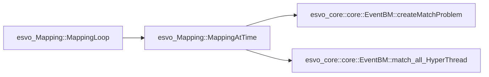

[Event-based Stereo Visual Odometry](https://doi.org/10.1109/TRO.2021.3062252) 提出了一种基于双目事件相机的视觉里程计。
在 [Github上开源了代码](https://github.com/HKUST-Aerial-Robotics/ESVO.git)，项目主要由 Cpp 实现，运行环境为 ROS, 本文的重点并不是如何运行代码，所以忽略了 ROS 中节点以及 launch file.  ~~TODO: 挖个坑以后填上~~，本文旨在对其中的功能实现的部分关键代码进行解读。

本文之后的部分将 Event-based Stereo Visual Odometry 简写为ESVO.
为了提高计算效率，达到实时性的要求，ESVO 采用了多线程的方法，将计算任务分配给多个线程，同时进行计算。Cpp 多线程的操作有待深入学习，~~我现在看不懂~~。

> TODO: Cpp Multithreading
{: .prompt-info }

## ESVO System Flowchart

ESVO 的 flowchat 如下图所示，主要由三大部分组成，分别是 Event Preprocessing, Mapping, Tracking.

Event Preprocessing
: 对输入的原始事件流进行滤波，生成 Time-Surface Maps.

Mapping
: 接收Time-Surface, 进行双目匹配，得到深度，生成 Local Map 与 Point Cloud.

Tracking
: 对 Local Map 进行跟踪，生成相机的 Pose(6Dof), 将变换矩阵返回给 Mapping 模块


_ESVO System Flowchart[^1]_

## ESVO 代码组成

> 本文图片若无特殊说明均来自于 `Scientific Toolworks Understand v6.4`
> {: .prompt-info }

ESVO 代码组成如下图所示，主要由三个模块组成，分别是 `esvo_time_surface`, `esvo_Mapping`, `esvo_Tracking`.

TimeSurface
: `esvo_time_surface` 中的 `TimeSurface` 实现了 Event Preprocessing 部分，对输入的原始事件流进行滤波，生成 Time-Surface Maps.

esvo_Mapping
: `esvo_core` 中的 `esvo_Mapping` 实现了 Mapping 部分，接收Time-Surface，得到深度，生成 Local Map 与 Point Cloud.

esvo_Tracking
: `esvo_core` 中的 `esvo_Tracking` 实现了 Tracking 部分，对 Local Map 进行跟踪，生成相机的 Pose(6Dof), 将变换矩阵返回给 Mapping 模块

esvo_MVStereo
: `esvo_core` 中的 `esvo_MVStereo` 实现了 ESVO mapper 部分，以及其他的一些 event-based mapping methods[^2][^3]. 作为 multi-view stereo (MVS) pipeline, 该模块需要先验的 pose 作为输入


### Time-Surface

Time-Surface 是一种将事件流转换为类似于图像帧的数据结构的方法，使得事件流的信息可以用传统的计算机视觉算法处理。Time-Surface 的核心思想是将事件流的时间信息转换为空间信息，将事件流的时间戳 $t_i$ 转换为像素的灰度，这样就可以将事件流转换为图像帧。
本博客在之前已经对 Time-Surface 做了详细的说明，你可以点击这里查看：[事件相机图像重构：浅谈Time-Surface](https://2c984r83y.github.io/posts/timesurface/ "事件相机图像重构：浅谈Time-Surface")


ESVO 中的 Time-Surface 实现在 `esvo_time_surface` 中，`TimeSurface_node.cpp`在 ROS 中作为节点运行，`TimeSurface.cpp` 实现了 Time-Surface 的核心算法以及滤波和矫正等功能。
由于水平有限所以在这里只分析 `void TimeSurface::createTimeSurfaceAtTime(const ros::Time& external_sync_time)`的实现，`void TimeSurface::createTimeSurfaceAtTime_hyperthread(const ros::Time& external_sync_time)`有待后续解读。
esvo_time_surface 文件架构如下图所示，`TimeSurface_node.cpp` 在 ROS 中启动节点，`TimeSurface.cpp` 实现了主要算法：


_esvo_time_surface architecture_

#### 初始化

在 `TimeSurface::createTimeSurfaceAtTime()`中：

```cpp
  // create exponential-decayed Time Surface map.
  const double decay_sec = decay_ms_ / 1000.0;
  cv::Mat time_surface_map;
  time_surface_map = cv::Mat::zeros(sensor_size_, CV_64F);
```

#### getMostRecentEventBeforeT

函数 `getMostRecentEventBeforeT`的功能是找到(x,y)处距离现在的时间 t 最近的事件，是较为关键的函数：

```cpp
  // 找到距离时间 t 最近的事件
  bool getMostRecentEventBeforeT(
    const size_t x,
    const size_t y,
    const ros::Time& t,
    dvs_msgs::Event* ev)
  {
    if(!insideImage(x, y))
      return false;
    // using EventQueue = std::deque<dvs_msgs::Event>;
    // 双向开口的deque，可以从头尾两端进行插入和删除操作
    EventQueue& eq = getEventQueue(x, y); // 访问向量中第 x + width_ * y 个元素
    if(eq.empty())
      return false; // 如果该像素点没有事件，返回false

    // 从后往前遍历deque，找到第一个时间戳小于t的事件
    // 即找到距离时间 t 最近的事件
    for(auto it = eq.rbegin(); it != eq.rend(); ++it)
    {
      const dvs_msgs::Event& e = *it;
      if(e.ts < t)
      {
        *ev = *it;
        return true;
      }
    }
    return false;
  }
```

#### 生成 Time-Surface

遍历所有坐标，若 `getMostRecentEventBeforeT`返回值为真，则将 `most_recent_event_at_coordXY_before_T`的时间戳转换为灰度值，赋值给 `time_surface_map`:

```cpp
  // Loop through all coordinates
  for(int y=0; y<sensor_size_.height; ++y)
  {
    for(int x=0; x<sensor_size_.width; ++x)
    {
      dvs_msgs::Event most_recent_event_at_coordXY_before_T;
      if(pEventQueueMat_->getMostRecentEventBeforeT(x, y, external_sync_time, &most_recent_event_at_coordXY_before_T))
      {
        // Time-Surface Implementation               
      }    
    }// loop x
  }// loop y
```

Time-Surface 有两种实现方式，Backward version 和 Forward version.

##### Backward version

Backward version 在事件坐标系下生成的，它直接在事件坐标系下生成 Time-Surface, 不需要相机的内参和外参信息。
从当前时间 t 开始，向前计算，时间戳越近，灰度值越大，即越亮。
公式定义如下所示：

$$
\mathcal{T}(\mathbf{x},t)\doteq\exp\left(-\frac{t-t_{\mathsf{last}}(\mathbf{x})}\eta\right)
$$

其中：
$t_last$ 是$(x,y)$处最近（最新）的事件的时间戳，即 `most_recent_event_at_coordXY_before_T.ts`
$t$ 是当前系统的时间戳，即 `external_sync_time`

```cpp
          const double dt = (external_sync_time - most_recent_stamp_at_coordXY).toSec();
          double polarity = (most_recent_event_at_coordXY_before_T.polarity) ? 1.0 : -1.0;
          double expVal = std::exp(-dt / decay_sec);
          if(!ignore_polarity_)
            expVal *= polarity;

          // Backward version
          if(time_surface_mode_ == BACKWARD)
            time_surface_map.at<double>(y,x) = expVal;
```

##### Forward version

Forward version 在相机坐标系下生成的，将事件投影到相机的图像平面上，然后在图像平面上生成时间表面。这个版本需要相机的内参和外参信息。
为了加快计算，使用了 look-up table 的方法，将事件投影到相机的图像平面上，然后在图像平面上生成时间表面。

```cpp
  // load look-up table
  for (size_t i = 0; i < sensor_size.height * sensor_size.width; i++)
  {
    precomputed_rectified_points_.col(i) = Eigen::Matrix<double, 2, 1>(
      RectCoordinates(i).x, RectCoordinates(i).y);
  }
```

```cpp
          // Forward version
          if(time_surface_mode_ == FORWARD && bCamInfoAvailable_)
          {
            Eigen::Matrix<double, 2, 1> uv_rect = precomputed_rectified_points_.block<2, 1>(0, y * sensor_size_.width + x);
            size_t u_i, v_i;
            if(uv_rect(0) >= 0 && uv_rect(1) >= 0)
            {
              u_i = std::floor(uv_rect(0)); // x coordinate, 下取整
              v_i = std::floor(uv_rect(1)); // y coordinate, 下取整

              if(u_i + 1 < sensor_size_.width && v_i + 1 < sensor_size_.height) //  防越界
              {
                double fu = uv_rect(0) - u_i;
                double fv = uv_rect(1) - v_i;
                double fu1 = 1.0 - fu;
                double fv1 = 1.0 - fv;
                time_surface_map.at<double>(v_i, u_i) += fu1 * fv1 * expVal;
                time_surface_map.at<double>(v_i, u_i + 1) += fu * fv1 * expVal;
                time_surface_map.at<double>(v_i + 1, u_i) += fu1 * fv * expVal;
                time_surface_map.at<double>(v_i + 1, u_i + 1) += fu * fv * expVal;

                if(time_surface_map.at<double>(v_i, u_i) > 1)
                  time_surface_map.at<double>(v_i, u_i) = 1;
                if(time_surface_map.at<double>(v_i, u_i + 1) > 1)
                  time_surface_map.at<double>(v_i, u_i + 1) = 1;
                if(time_surface_map.at<double>(v_i + 1, u_i) > 1)
                  time_surface_map.at<double>(v_i + 1, u_i) = 1;
                if(time_surface_map.at<double>(v_i + 1, u_i + 1) > 1)
                  time_surface_map.at<double>(v_i + 1, u_i + 1) = 1;
              }
```

### Mapping

Mapping 部分代码在 `esvo_core` 中实现， Mapping 的主要功能是接收 Time-Surface, 进行双目匹配，得到深度。
ESVO 创新性地提出了一种基于非线性优化衡量事件流时空一致性的目标函数的 mapping 方法。
在 `esvo_core\src\core\esvo_Mapping.cpp` 中：
函数调用关系如下所示：



#### CreatMatchProblem

这里定义了一个名为 `createMatchProblem`的函数，它接受三个参数：`StampedTimeSurfaceObs * pStampedTsObs`，`StampTransformationMap * pSt_map`和 `std::vector<dvs_msgs::Event *>* pvEventsPtr`。在函数内部，它将这些参数存储在类成员变量中，并为每个事件设置了一个视差搜索范围。因此，可以说这个函数创建了一个匹配问题。

```cpp
void esvo_core::core::EventBM::createMatchProblem(
  StampedTimeSurfaceObs * pStampedTsObs,
  StampTransformationMap * pSt_map,
  std::vector<dvs_msgs::Event *>* pvEventsPtr)
{
  pStampedTsObs_ = pStampedTsObs;
  pSt_map_ = pSt_map;
  size_t numEvents = pvEventsPtr->size();
  vEventsPtr_.clear();
  vEventsPtr_.reserve(numEvents);
  vEventsPtr_.insert(vEventsPtr_.end(), pvEventsPtr->begin(), pvEventsPtr->end());

  if(bSmoothTS_)
  {
    if(pStampedTsObs_)
      pStampedTsObs_->second.GaussianBlurTS(5);
  }

  vpDisparitySearchBound_.clear();
  vpDisparitySearchBound_.reserve(numEvents);
  for(size_t i = 0; i < vEventsPtr_.size(); i++)
    vpDisparitySearchBound_.push_back(std::make_pair(min_disparity_, max_disparity_));
}
```

#### Block Match

非线性优化目标函数的使其最小的过程需要初值，ESVO 采用了 ZNCC 块匹配 Block Match 的方法，相较于暴力搜索 Bruteforce Search 更高效。
关于 ZNCC 的原理，本博客在之前已经做了详细的说明，你可以点击这里查看：[详解零均值归一化：ZNCC](https://2c984r83y.github.io/posts/NCC_ZNCC/ "详解零均值归一化：ZNCC")

初始化部分求左右目的视差值的代码是在 `esvo_core\src\core\EventBM.cpp` 中实现的，函数调用关系如下所示：

> 全写应为 `esvo_core::core::EventBM::match_all_HyperThread`，为了排版简写为 `EventBM::match_all_HyperThread`


`match_an_event` 函数实现了双目匹配的核心算法，调用了 `bool esvo_core::core::EventBM::epipolarSearching`
`epipolarSearching` 计算 ZNCC 的 cost.


#### Problem Solver

> TODO: Problem Solver
{: .prompt-info }

### Tracking

> TODO: Tracking
{: .prompt-info }

## Reference

[^1]: ZHOU Y, GALLEGO G, SHEN S. “Event-based Stereo Visual Odometry,” IEEE Transactions on Robotics, 37(5): 1433-1450, 2021. DOI:[10.1109/TRO.2021.3062252](https://doi.org/10.1109/TRO.2021.3062252).
    
[^2]: S.-H. Ieng, J. Carneiro, M. Osswald, and R. Benosman, “Neuromorphic event-based generalized time-based stereovision,” Front. Neurosci., vol. 12, p. 442, 2018.
    
[^3]: H. Hirschmuller, “Stereo processing by semiglobal matching and mutual information,” IEEE Trans. Pattern Anal. Mach. Intell., vol. 30, no. 2, pp. 328–341, Feb. 2008.
